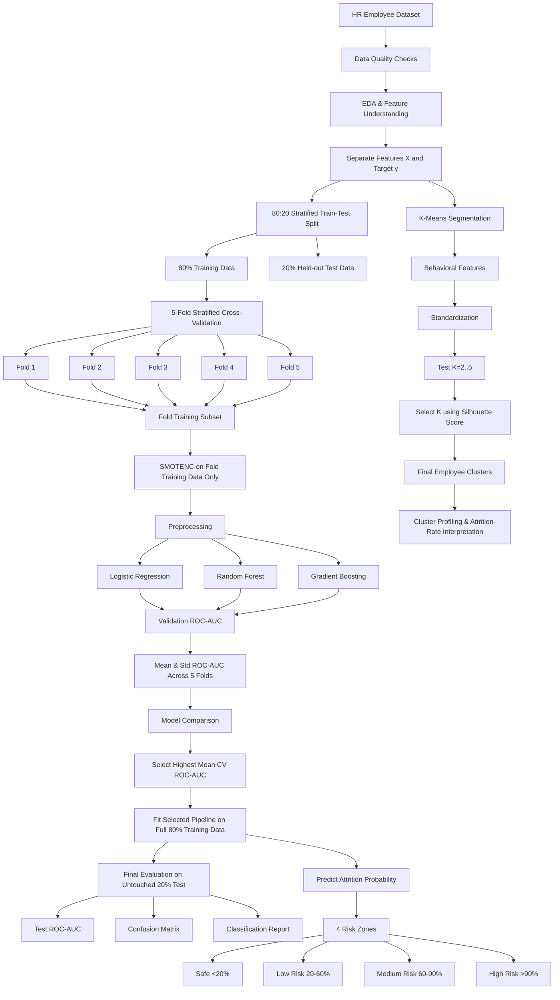

# Employee Turnover Prediction & Retention Analytics

An end-to-end machine learning project for **employee attrition prediction, risk scoring, and behavioral segmentation**. The project combines exploratory data analysis, leakage-safe supervised learning, class-imbalance handling, model comparison, final test evaluation, and unsupervised employee segmentation.

## Project Objective

Employee turnover can be costly for organizations. This project builds a data-driven pipeline to:

- Analyze factors associated with employee attrition.
- Predict whether an employee is likely to leave.
- Handle class imbalance without leaking validation/test information.
- Compare multiple classification models using **5-fold ROC-AUC cross-validation**.
- Select the best model using only the training data.
- Evaluate the selected model once on an untouched test set.
- Convert predicted probabilities into four business-facing risk zones.
- Segment employees into behavioral groups using **K-Means**, independently of the attrition target.

---

## End-to-End Pipeline



### Key design principle

The **20% test set remains untouched throughout model selection**. During each CV fold, `SMOTENC` is applied only to that fold's training subset; the validation fold is kept untouched.

---

## Dataset

The project uses the **HR Employee Attrition** dataset sourced from Kaggle:

[HR Employee Attrition Dataset](https://www.kaggle.com/liujiaqi/hr-comma-sepcsv)

### Main Features

| Feature | Description |
|---|---|
| `satisfaction_level` | Employee satisfaction level |
| `last_evaluation` | Last evaluation score |
| `number_project` | Number of projects handled |
| `average_montly_hours` | Average monthly working hours |
| `time_spend_company` | Years spent at the company |
| `Work_accident` | Whether the employee experienced a work accident |
| `promotion_last_5years` | Promotion indicator |
| `department` | Employee department |
| `salary` | Salary category |
| `left` | Target: `0 = Stayed`, `1 = Left` |

---

# Methodology

## 1. Data Quality & Exploratory Data Analysis

The notebook first checks the structure and quality of the HR dataset and then performs exploratory analysis.

### Analysis includes

- Missing-value checks
- Data types and descriptive statistics
- Cardinality checks for categorical variables
- Correlation heatmap
- Satisfaction-level distribution
- Last-evaluation distribution
- Average-monthly-hours distribution
- Project-count comparison for employees who stayed vs. left

The EDA stage is used to understand workforce patterns before supervised modelling.

---

## 2. Leakage-Safe Train-Test Split

The target variable is `left`.

The dataset is split using:

**80% training / 20% test**

with a **stratified split** so that the class distribution is preserved approximately in both subsets.

The 20% test set is held out before any resampling or model fitting.

```text
100% Data
   |
   +---- 80% Training
   |
   +---- 20% Final Test  <-- untouched
```

---

## 3. Handling Class Imbalance with SMOTENC

Employee attrition is an imbalanced classification problem.

Because the dataset contains both numerical and categorical features, the project uses **SMOTENC** rather than applying plain SMOTE to encoded mixed-type data.

The important implementation detail is that resampling happens **inside the CV pipeline**:

```text
CV Fold
  |
  +-- Training subset
  |      |
  |    SMOTENC
  |      |
  |   Preprocess
  |      |
  |    Model
  |
  +-- Validation subset
         |
      untouched
```

This prevents synthetic samples generated from one fold from influencing another fold's validation data.

---

## 4. Model Comparison with 5-Fold Cross-Validation

Three candidate classifiers are evaluated:

1. **Logistic Regression** — interpretable linear baseline
2. **Random Forest** — nonlinear bagging ensemble
3. **Gradient Boosting** — sequential boosting ensemble

A **5-fold Stratified Cross-Validation** strategy is used on the 80% training set.

For every fold:

- Four folds are used for training.
- One fold is used for validation.
- `SMOTENC` is fitted only on the training portion.
- The validation fold is kept untouched.
- **ROC-AUC** is measured on the validation fold.

The final comparison is based on:

- Fold 1 ROC-AUC
- Fold 2 ROC-AUC
- Fold 3 ROC-AUC
- Fold 4 ROC-AUC
- Fold 5 ROC-AUC
- **Mean ROC-AUC**
- **Standard deviation of ROC-AUC**

### Model-selection rule

The model with the **highest mean 5-fold validation ROC-AUC** is selected.

No test-set metric is used to choose the model.

---

## 5. Model Comparison Visualization

The notebook includes a model comparison plot showing:

**Mean 5-Fold ROC-AUC ± Standard Deviation**

for:

- Logistic Regression
- Random Forest
- Gradient Boosting

This plot is generated exclusively from validation-fold results on the 80% training data.

---

## 6. Final Model Training & Evaluation

After model selection:

```text
Best Model
    |
    v
Full 80% Training Data
    |
    v
Fit complete pipeline
    |
    v
Untouched 20% Test Data
    |
    +--> Accuracy
    +--> ROC-AUC
    +--> Classification Report
    +--> Confusion Matrix
    +--> ROC Curve
```

The held-out test set is used **once for final evaluation**, providing an unbiased estimate after model selection.

---

## 7. Employee Risk Scoring

The selected model generates an **individual attrition probability** for each employee.

These probabilities are mapped to four business-facing risk zones:

| Risk Zone | Predicted Attrition Probability |
|---|---:|
| Safe Zone | `< 20%` |
| Low Risk | `20% – <60%` |
| Medium Risk | `60% – <90%` |
| High Risk | `>= 90%` |

This creates a simple risk-scoring layer that can support prioritization of retention efforts.

> Risk zones are probability thresholds applied to the classifier output. They are **not** K-Means clusters.

---

## 8. K-Means Employee Segmentation

K-Means is used as a **separate unsupervised segmentation layer**.

The clustering stage does **not use the target variable `left` to create clusters**.

Behavioral features used for segmentation include:

- `satisfaction_level`
- `last_evaluation`
- `number_project`
- `average_montly_hours`
- `time_spend_company`

### Cluster-selection process

```text
Behavioral Features
        |
        v
Standardization
        |
        v
Try K = 2, 3, 4, 5
        |
        v
Calculate Silhouette Score
        |
        v
Select K with highest score
        |
        v
Fit final K-Means
        |
        v
Profile each employee segment
```

After clustering, the notebook calculates the **attrition rate and average behavioral characteristics of each cluster** for business interpretation.

This keeps **cluster formation** separate from **attrition prediction**.

---

# Project Structure

```text
Employee-Turnover-Analytics/
│
├── Employee_Turnover_Analytics.ipynb
├── README.md
└── LICENSE
```

The notebook downloads the public dataset through `kagglehub`, so the raw CSV does not have to be committed to the repository.

---

# Technologies Used

### Programming & Data

- Python
- Pandas
- NumPy

### Visualization

- Matplotlib
- Seaborn

### Machine Learning

- Scikit-learn
- Imbalanced-learn
- Logistic Regression
- Random Forest
- Gradient Boosting
- K-Means
- Stratified K-Fold Cross-Validation
- ROC-AUC
- Silhouette Score

### Dataset Access

- KaggleHub

---

# How to Run

### 1. Clone the repository

```bash
git clone https://github.com/nishanttiwari227/Employee-Turnover-Analytics.git
cd Employee-Turnover-Analytics
```

### 2. Open the notebook

```text
Employee_Turnover_Analytics.ipynb
```

Open it in Jupyter Notebook, JupyterLab, or Google Colab.

### 3. Run all cells

The notebook installs/uses the required dataset-access dependency, downloads the public HR dataset, performs EDA, runs cross-validation, trains the selected model, evaluates the final test set, generates risk scores, and performs K-Means segmentation.

---

# Key Engineering Decisions

### Why Stratified Split?

To keep the attrition/stay class proportions approximately consistent between training and test sets.

### Why 5-Fold CV?

A single validation split can make model selection sensitive to which rows happen to be held out. Five-fold CV evaluates the model across five different validation partitions and uses the mean ROC-AUC for comparison.

### Why SMOTENC?

The dataset contains both numeric and categorical variables. `SMOTENC` is appropriate for mixed feature types and is integrated inside the CV pipeline to prevent validation leakage.

### Why ROC-AUC?

Attrition is an imbalanced classification problem, so ROC-AUC provides a threshold-independent measure of how well the model separates employees who leave from those who stay.

### Why Logistic Regression?

It provides an interpretable baseline against which the more complex tree-based ensembles can be compared.

### Why Random Forest?

It captures nonlinear relationships and feature interactions through an ensemble of randomized decision trees.

### Why Gradient Boosting?

It builds trees sequentially, with later trees focusing on correcting errors from earlier stages, making it a strong candidate for nonlinear predictive patterns.

### Why K-Means separately?

Prediction answers **“Who is likely to leave?”** while clustering answers **“What behavioral groups exist among employees?”** Keeping the two tasks separate makes the analytical design easier to interpret.

---

# Results Interpretation

The notebook produces two different kinds of outputs:

### Predictive Outputs

- 5-fold ROC-AUC for each candidate model
- Mean and standard deviation of CV ROC-AUC
- Selected model
- Final test ROC-AUC
- Test accuracy
- Classification report
- Confusion matrix
- ROC curve
- Employee-level attrition probabilities
- Four risk zones

### Segmentation Outputs

- Silhouette scores for candidate K values
- Selected number of clusters
- Employee cluster assignments
- Cluster-level attrition rates
- Behavioral profiles for each segment
- K-Means visualization

The final selected classifier is determined **programmatically from mean CV ROC-AUC**, rather than assuming a particular model in advance.

---

# Business Interpretation

The project creates two complementary views of employee turnover:

```text
                 Employee Analytics
                        |
          +-------------+-------------+
          |                           |
          v                           v
   Attrition Prediction         Behavioral Segmentation
          |                           |
          v                           v
 Probability of Leaving          Employee Clusters
          |                           |
          v                           v
     Risk Zones                Segment Profiles
```

This allows an organization to distinguish between:

- **individual attrition risk** based on model probability, and
- **broader workforce segments** based on employee behavior.

---

# Conclusion

This project demonstrates an end-to-end employee analytics workflow combining:

- Exploratory data analysis
- Stratified train-test splitting
- Leakage-safe SMOTENC resampling
- 5-fold ROC-AUC cross-validation
- Logistic Regression baseline
- Random Forest
- Gradient Boosting
- Final held-out test evaluation
- Probability-based risk scoring
- Unsupervised K-Means segmentation

The resulting pipeline separates **model selection, final evaluation, risk scoring, and behavioral segmentation**, making the workflow easier to audit and extend.

---

# License

This project is licensed under the MIT License. See the `LICENSE` file for details.

---

# Acknowledgments

- Kaggle — HR Employee Attrition dataset
- Scikit-learn — machine learning and evaluation tools
- Imbalanced-learn — SMOTENC implementation
- Matplotlib & Seaborn — visualization
